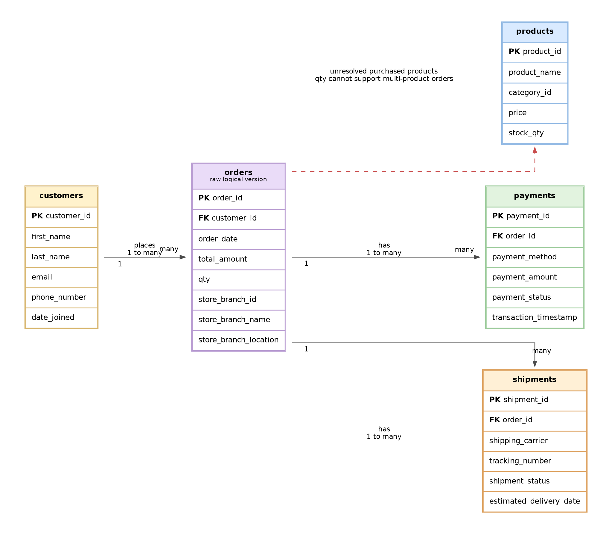

# Retail Sales Order Management Data Modeling Project

## Table of Contents

- [1. Executive Summary](#1-executive-summary)
- [2. Business Problem](#2-business-problem)
- [3. Project Scope](#3-project-scope)
- [4. Business Requirements](#4-business-requirements)
- [5. Initial ER Model from Raw Requirements](#5-initial-er-model-from-raw-requirements)
- [6. Normalization Walkthrough](#6-normalization-walkthrough)
- [7. Final ER Diagram](#7-final-er-diagram)
- [8. Physical SQL Design](#8-physical-sql-design)
- [9. OLAP Star Schema Design](#9-olap-star-schema-design)
- [10. Data Quality and Integrity Rules](#10-data-quality-and-integrity-rules)
- [11. Assumptions](#11-assumptions)
- [12. How to Use the Project Files](#12-how-to-use-the-project-files)
- [13. Future Enhancements](#13-future-enhancements)
- [14. Conclusion](#14-conclusion)

## 1. Executive Summary

This project designs a complete data model for a retail order management system. The system must store customers, products, orders, store branches, payments, and shipment information. The work starts from business requirements, converts those requirements into an initial entity relationship design, identifies normalization issues, and then produces a final normalized OLTP model and an OLAP star schema for sales analytics.

The final transactional model is designed in third normal form for operational reliability. It separates customer, product, branch, order, order item, payment, and shipment data into dedicated tables with clear primary keys, foreign keys, cardinality rules, and constraints. The analytical model is designed as a star schema with a central `fact_sales` table connected to customer, product, branch, payment, shipment, and date dimensions.

## 2. Business Problem

A company sells products to customers through multiple store branches. The business needs a structured database design that can support day-to-day order processing and also provide a foundation for reporting and analytics.

The database must answer operational questions such as:

- Which customer placed a specific order?
- Which branch processed the order?
- Which products were included in the order?
- How was the order paid?
- What is the current shipment status?

It must also support analytical questions such as:

- What are total sales by product, branch, and date?
- Which customers generate the most revenue?
- Which payment methods are most common?
- How do shipment statuses affect order fulfillment performance?

## 3. Project Scope

The project includes:

1. Requirement analysis from the provided business rules.
2. Initial ER model based on raw requirements.
3. Normalization analysis and model improvements.
4. Final normalized ER diagram for OLTP processing.
5. PostgreSQL SQL schema for the final ER model.
6. OLAP star schema diagram for sales analytics.
7. GitHub-ready documentation and repository structure.

The project does not include application code, user interface design, sample data generation, stored procedures, or full ETL implementation. Those can be added as future enhancements.

## 4. Business Requirements

### 4.1 Customer Management

The system stores customer information for people who purchase products from the company.

Main attributes:

- Customer ID
- First Name
- Last Name
- Email
- Phone Number
- Date Joined

### 4.2 Product Catalog Management

The system maintains a catalog of products available for sale.

Main attributes:

- Product ID
- Product Name
- Category ID
- Price
- Stock Quantity

### 4.3 Order Processing

The system records customer orders. Each order stores the order date, total amount, and the store branch responsible for processing the order.

Main attributes:

- Order ID
- Order Date
- Total Amount
- Quantity

Business rule:

- A customer can place many orders.
- Each order belongs to exactly one customer.

### 4.4 Store Branch Management

The company operates multiple store branches that process customer orders.

Main attributes:

- Store Branch ID
- Store Branch Name
- Store Branch Location

Business rule:

- A store branch can process many orders.
- Each order is processed by one store branch.

### 4.5 Payment Management

The system records payment details for customer orders.

Main attributes:

- Payment ID
- Payment Method
- Payment Amount
- Payment Status
- Transaction Timestamp

Business rule:

- An order can have one or more payments.
- Each payment belongs to one order.

### 4.6 Shipment Tracking

The system tracks shipment information for customer orders.

Main attributes:

- Shipment ID
- Shipping Carrier
- Tracking Number
- Shipment Status
- Estimated Delivery Date

Business rule:

- An order can have one or more shipments.
- Each shipment belongs to one order.

## 5. Initial ER Model from Raw Requirements

The first logical model directly reflects the raw requirements. It identifies the main subjects: customers, orders, products, payments, and shipments. In the initial version, the order entity contains order-level fields and also includes branch information and a single quantity field.



### 5.1 Issues Found in the Initial Model

The initial model is useful for understanding the business domain, but it has several design issues that must be corrected before building a production database.

| Issue | Why it is a problem | Normalized solution |
|---|---|---|
| Branch name and location are stored with orders | Branch details would be repeated for every order processed by the same branch. This creates update anomalies. | Create a separate `store_branch` table and keep only `store_branch_id` in `orders`. |
| `qty` is stored directly in `orders` | One order can contain multiple products, and each product can have its own quantity. A single order-level quantity is ambiguous. | Create an `order_items` table with `order_id`, `product_id`, `qty`, and `line_amount`. |
| Products are not fully connected to orders | Sales cannot be analyzed by product unless the order-to-product relationship is captured. | Use `order_items` as the bridge between `orders` and `products`. |
| Payment and shipment records are order-specific | Payments and shipments can occur multiple times for a single order. | Keep `payments` and `shipments` as child tables of `orders`. |
| Repeated descriptive data can cause inconsistencies | Duplicated values make inserts, updates, and deletes risky. | Separate master data and transaction data using normalization. |

## 6. Normalization Walkthrough

### 6.1 First Normal Form

First normal form requires atomic columns and removal of repeating groups. The raw order design had a single `qty` field, but a real order can contain multiple products. Quantity belongs to the product line in the order, not to the order header. The solution is to create the `order_items` table.

Resulting change:

- Remove `qty` from `orders`.
- Add `order_items` with `order_item_id`, `order_id`, `product_id`, `qty`, and `line_amount`.

### 6.2 Second Normal Form

Second normal form requires non-key attributes to depend on the whole key. The order item record represents the relationship between one order and one product. Attributes such as `qty` and `line_amount` depend on the order-product line, so they belong in `order_items`.

Resulting change:

- `orders` stores order header information.
- `order_items` stores order line information.
- `products` stores product catalog information.

### 6.3 Third Normal Form

Third normal form removes transitive dependencies. In the initial model, `store_branch_name` and `store_branch_location` were stored with the order. These attributes depend on `store_branch_id`, not on `order_id`. Therefore, branch details must be stored in a separate `store_branch` table.

Resulting change:

- Create `store_branch` with `store_branch_id`, `store_branch_name`, and `store_branch_location`.
- Keep only `store_branch_id` in `orders` as a foreign key.

### 6.4 Final Normalization Outcome

After normalization, the model has clear separation between master data and transaction data.

Master data tables:

- `customers`
- `products`
- `store_branch`

Transaction tables:

- `orders`
- `order_items`
- `payments`
- `shipments`

This design reduces redundancy, improves data quality, supports multi-product orders, and provides a reliable structure for downstream analytics.

## 7. Final ER Diagram

The final ER diagram represents the normalized OLTP model.


### 7.1 Final Tables

| Table | Purpose |
|---|---|
| `customers` | Stores customer profile and contact details. |
| `products` | Stores product catalog information. |
| `store_branch` | Stores branch details for stores that process orders. |
| `orders` | Stores order header information. |
| `order_items` | Stores product-level order lines and resolves the many-to-many relationship between orders and products. |
| `payments` | Stores payment records for orders. |
| `shipments` | Stores shipment tracking records for orders. |

### 7.2 Relationship Summary

| Relationship | Cardinality | Implementation |
|---|---:|---|
| Customer to Orders | One-to-many | `orders.customer_id` references `customers.customer_id`. |
| Store Branch to Orders | One-to-many | `orders.store_branch_id` references `store_branch.store_branch_id`. |
| Orders to Order Items | One-to-many | `order_items.order_id` references `orders.order_id`. |
| Products to Order Items | One-to-many | `order_items.product_id` references `products.product_id`. |
| Orders to Payments | One-to-many | `payments.order_id` references `orders.order_id`. |
| Orders to Shipments | One-to-many | `shipments.order_id` references `orders.order_id`. |

### 7.3 Data Dictionary

#### customers

| Column | Key | Description |
|---|---|---|
| `customer_id` | PK | Unique identifier for each customer. |
| `first_name` |  | Customer first name. |
| `last_name` |  | Customer last name. |
| `email` | Unique | Customer email address. |
| `phone_number` |  | Customer phone number. |
| `date_joined` |  | Date the customer joined. |

#### products

| Column | Key | Description |
|---|---|---|
| `product_id` | PK | Unique identifier for each product. |
| `product_name` |  | Name of the product. |
| `category_id` |  | Product category identifier. |
| `price` |  | Current product price. |
| `stock_qty` |  | Available stock quantity. |

#### store_branch

| Column | Key | Description |
|---|---|---|
| `store_branch_id` | PK | Unique identifier for each branch. |
| `store_branch_name` | Unique | Branch name. |
| `store_branch_location` |  | Branch location. |

#### orders

| Column | Key | Description |
|---|---|---|
| `order_id` | PK | Unique identifier for each order. |
| `customer_id` | FK | Customer who placed the order. |
| `order_date` |  | Date and time when the order was placed. |
| `total_amount` |  | Total amount for the order. |
| `store_branch_id` | FK | Branch that processed the order. |

#### order_items

| Column | Key | Description |
|---|---|---|
| `order_item_id` | PK | Unique identifier for each order line. |
| `order_id` | FK | Order that contains the line item. |
| `product_id` | FK | Product sold on the line item. |
| `qty` |  | Quantity of product sold. |
| `line_amount` |  | Sales amount for the line item. |

#### payments

| Column | Key | Description |
|---|---|---|
| `payment_id` | PK | Unique identifier for each payment. |
| `order_id` | FK | Order associated with the payment. |
| `payment_method` |  | Method used for payment. |
| `payment_amount` |  | Payment amount. |
| `payment_status` |  | Current payment status. |
| `transaction_timestamp` |  | Timestamp of the payment transaction. |

#### shipments

| Column | Key | Description |
|---|---|---|
| `shipment_id` | PK | Unique identifier for each shipment. |
| `order_id` | FK | Order associated with the shipment. |
| `shipping_carrier` |  | Carrier used to ship the order. |
| `tracking_number` | Unique | Carrier tracking number. |
| `shipment_status` |  | Current shipment status. |
| `estimated_delivery_date` |  | Estimated delivery date. |

## 8. Physical SQL Design

The SQL implementation is provided in `sql/01_create_oltp_schema.sql`. It is written for PostgreSQL and includes:

- Schema creation.
- Tables for all final ER entities.
- Primary key constraints.
- Foreign key constraints.
- Unique constraints.
- Check constraints for numeric and status fields.
- Indexes on foreign keys and common query columns.
- A reporting view named `vw_order_sales_detail`.

The design uses surrogate primary keys with generated identity columns. Foreign keys enforce referential integrity between parent and child tables. Check constraints protect core data quality rules such as positive quantity, non-negative amounts, valid payment statuses, and valid shipment statuses.

## 9. OLAP Star Schema Design

The OLTP model is optimized for transaction processing and data integrity. For reporting and dashboards, a dimensional model is easier to query and performs better for aggregation. The OLAP model uses a central `fact_sales` table surrounded by dimensions.


### 9.1 Fact Table Grain

The grain of `fact_sales` is one order item sales line. This means each row represents one product sold as part of an order.

The fact table includes measurable values such as:

- Quantity sold.
- Line amount.
- Order total amount.
- Payment amount.

It also includes foreign keys to dimensions for slicing sales by customer, product, branch, payment, shipment, and date.

### 9.2 Dimensions

| Dimension | Purpose |
|---|---|
| `dim_customers` | Analyze sales by customer attributes. |
| `dim_products` | Analyze sales by product and category. |
| `dim_branch` | Analyze sales by store branch and location. |
| `dim_payments` | Analyze sales by payment method and payment status. |
| `dim_shipment` | Analyze sales by carrier and shipment status. |
| `dim_date` | Analyze sales by day, month, quarter, and year. |

### 9.3 OLTP to OLAP Mapping

| Star Schema Column | Source Table | Source Column |
|---|---|---|
| `dim_customers.customer_id` | `customers` | `customer_id` |
| `dim_products.product_id` | `products` | `product_id` |
| `dim_branch.store_branch_id` | `store_branch` | `store_branch_id` |
| `dim_payments.payment_id` | `payments` | `payment_id` |
| `dim_shipment.shipment_id` | `shipments` | `shipment_id` |
| `fact_sales.order_id` | `orders` | `order_id` |
| `fact_sales.order_item_id` | `order_items` | `order_item_id` |
| `fact_sales.qty` | `order_items` | `qty` |
| `fact_sales.line_amount` | `order_items` | `line_amount` |
| `fact_sales.order_total_amount` | `orders` | `total_amount` |
| `fact_sales.payment_amount` | `payments` | `payment_amount` |
| `fact_sales.order_date_key` | `orders` / `dim_date` | `order_date` mapped to `date_key` |

### 9.4 Important OLAP Assumption

The OLTP requirements allow one order to have multiple payments and multiple shipments. A simple star schema with one `fact_sales` table can still be used, but the ETL must define how payment and shipment records are selected or allocated. For example, the warehouse may use the latest shipment status and the completed payment record. In a larger production warehouse, separate `fact_payment` and `fact_shipment` tables or bridge tables can be added to avoid double counting when orders have split payments or split shipments.

## 10. Data Quality and Integrity Rules

The schema applies the following controls:

| Rule | Implementation |
|---|---|
| Customers must have unique emails. | `UNIQUE (email)` in `customers`. |
| Product prices cannot be negative. | Check constraint on `products.price`. |
| Stock quantity cannot be negative. | Check constraint on `products.stock_qty`. |
| Order total amount cannot be negative. | Check constraint on `orders.total_amount`. |
| Order line quantity must be greater than zero. | Check constraint on `order_items.qty`. |
| Payments must belong to an existing order. | Foreign key from `payments.order_id` to `orders.order_id`. |
| Shipments must belong to an existing order. | Foreign key from `shipments.order_id` to `orders.order_id`. |
| Shipment tracking numbers should not duplicate. | Unique constraint on `shipments.tracking_number`. |

## 11. Assumptions

The following assumptions were made to complete the design:

1. `category_id` is kept as an attribute of `products` because the requirements did not provide category name or category description fields.
2. `total_amount` and `line_amount` are stored for reporting and audit convenience. In a production application, these values should be calculated or validated using pricing, discount, and tax rules.
3. A customer email is treated as unique.
4. Each order is processed by exactly one store branch.
5. The SQL schema uses PostgreSQL syntax.
6. The OLAP star schema is a dimensional reporting model, not a replacement for the normalized transactional schema.

## 12. How to Use the Project Files

Run the OLTP schema in PostgreSQL:

```sql
\i sql/01_create_oltp_schema.sql
```

Run the OLAP star schema in PostgreSQL:

```sql
\i sql/02_create_olap_star_schema.sql
```

The diagrams are available in both source and rendered formats under the `diagrams/` folder. The Markdown files can be viewed directly in GitHub.

## 13. Future Enhancements

Potential improvements include:

- Add a `product_category` table if category names and descriptions are required.
- Add sample seed data and validation queries.
- Add triggers or stored procedures to calculate order totals from order items.
- Add audit columns such as `created_at`, `updated_at`, and `created_by`.
- Add a full ETL pipeline from OLTP tables into the OLAP star schema.
- Add separate facts for payments and shipments to support complex split-payment and split-shipment scenarios.

## 14. Conclusion

This project converts raw retail business requirements into a normalized operational data model and a dimensional analytics model. The final ER design improves the initial model by separating store branch details, resolving multi-product orders through `order_items`, and enforcing relationships between orders, payments, shipments, products, customers, and branches. The OLAP star schema then makes the same data easier to analyze by customer, product, branch, payment, shipment, and date.
