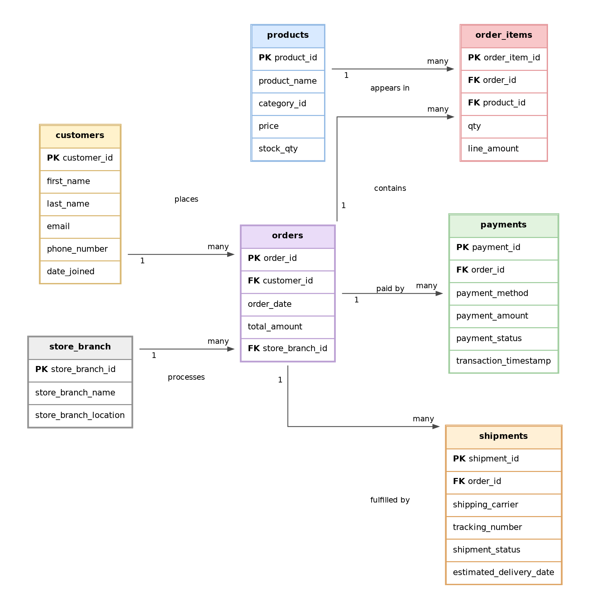
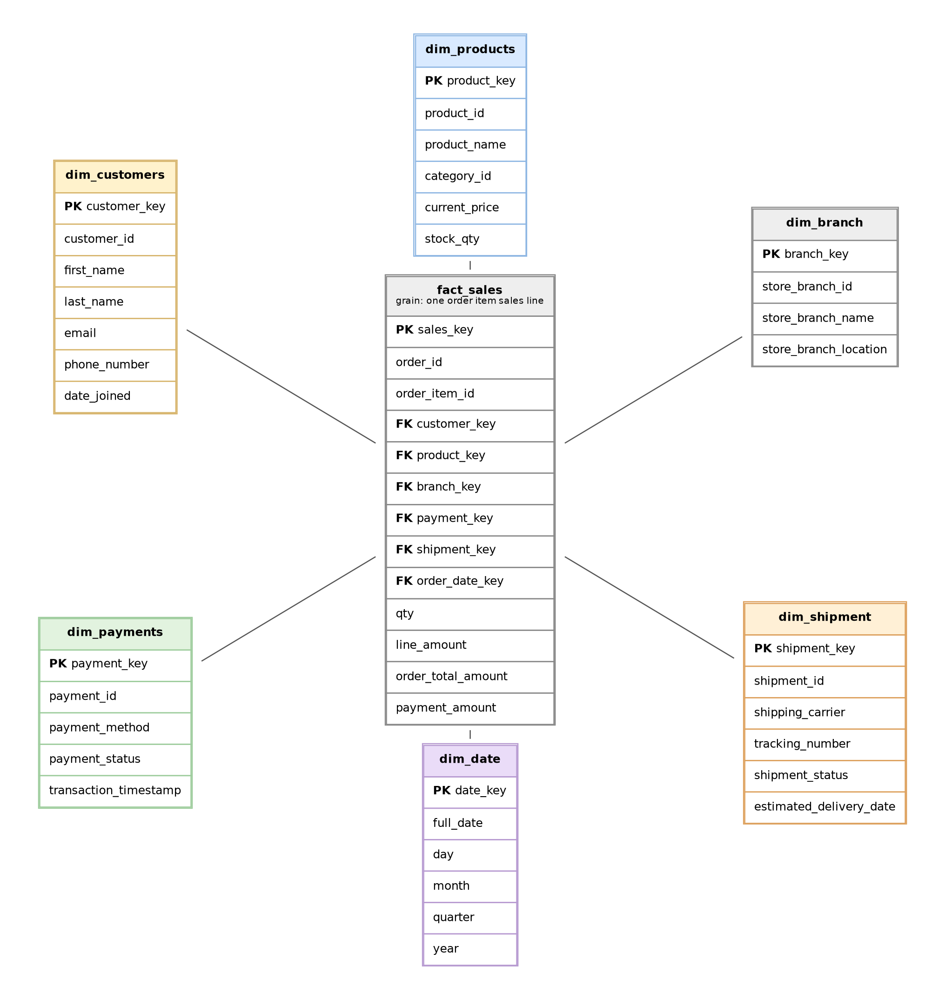

# Retail Sales Order Management Data Modeling Project

This repository contains a complete data modeling project for a retail sales order management system. The project starts from business requirements, builds an initial ER model, normalizes the design, creates a final OLTP ER diagram, and adds an OLAP star schema for analytics.

## Project Deliverables

| Deliverable | File |
|---|---|
| Full project report | [`PROJECT_REPORT.md`](PROJECT_REPORT.md) |
| Project report PDF | [`docs/project_report.pdf`](docs/project_report.pdf) |
| Project report DOCX | [`docs/project_report.docx`](docs/project_report.docx) |
| Final ER diagram | [`diagrams/final_er_diagram.png`](diagrams/final_er_diagram.png) |
| OLAP star schema diagram | [`diagrams/star_schema_olap.png`](diagrams/star_schema_olap.png) |
| OLTP SQL schema | [`sql/01_create_oltp_schema.sql`](sql/01_create_oltp_schema.sql) |
| OLAP SQL schema | [`sql/02_create_olap_star_schema.sql`](sql/02_create_olap_star_schema.sql) |
| Data dictionary | [`docs/data_dictionary.md`](docs/data_dictionary.md) |
| Normalization walkthrough | [`docs/normalization_walkthrough.md`](docs/normalization_walkthrough.md) |

## Problem Statement

The company sells products to customers through multiple store branches. It needs a database that can store customer orders, products, payments, and shipments without duplication or inconsistent data. It also needs a reporting-friendly model for analyzing sales by customer, product, branch, payment method, shipment status, and date.

## Final OLTP ER Diagram

The final OLTP model is normalized and separates master data from transaction data.



## OLAP Star Schema

The OLAP model uses `fact_sales` as the central fact table. The grain is one order item sales line.



## Repository Structure

```text
retail_data_modeling_github/
├── README.md
├── PROJECT_REPORT.md
├── diagrams/
│   ├── initial_er_diagram.png
│   ├── final_er_diagram.png
│   ├── star_schema_olap.png
├── docs/
│   ├── data_dictionary.md
│   ├── normalization_walkthrough.md
│   ├── project_report.docx
│   └── project_report.pdf
└── sql/
    ├── 01_create_oltp_schema.sql
    └── 02_create_olap_star_schema.sql
```

## How to Run the SQL

The SQL scripts use PostgreSQL syntax.

Create the normalized OLTP schema:

```bash
psql -d your_database_name -f sql/01_create_oltp_schema.sql
```

Create the OLAP star schema:

```bash
psql -d your_database_name -f sql/02_create_olap_star_schema.sql
```

## Design Summary

The initial model captured the main business entities but had normalization problems. Branch details were repeated with orders, order quantity was stored at the order level, and the product-to-order relationship was not fully resolved. The final model fixes these issues by creating:

- `store_branch` for branch master data.
- `order_items` to support multi-product orders.
- Foreign key relationships between orders, customers, branches, products, payments, and shipments.
- A star schema for analytics with `fact_sales` and six dimensions.

## Key Assumptions

- Customer email is unique.
- Each order belongs to one customer.
- Each order is processed by one store branch.
- An order can have multiple payments and multiple shipments.
- `category_id` is stored on `products` because category details were not part of the original requirements.
- The OLAP model is designed for reporting and does not replace the normalized OLTP model.

## Future Improvements

Possible next steps include adding sample data, validation queries, a product category table, audit columns, automated ETL scripts, and separate payment or shipment fact tables for more advanced analytics.
